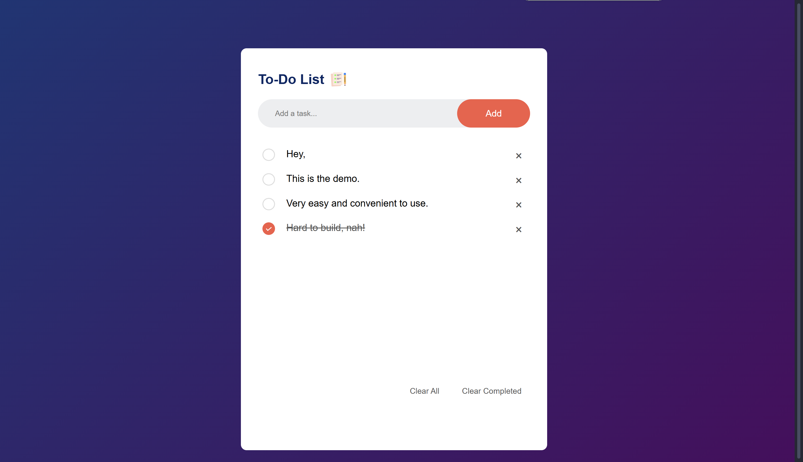

# 📝 To-Do List App

A responsive and user-friendly **To-Do List web app** built using **HTML**, **CSS**, and **Vanilla JavaScript**. This app allows users to manage their tasks efficiently with features like add, delete, mark as complete, clear all or clear completed tasks to make it look cleaner.

---

## 📸 Preview

---

## ✨ Features

- ✅ Add tasks by clicking "Add" or pressing "Enter"
- 🗑️ Delete individual tasks using the ❌ icon
- ☑️ Mark tasks as completed (toggle)
- 🧹 Clear all or only completed tasks with a single click
- 📱 Fully responsive design

---

