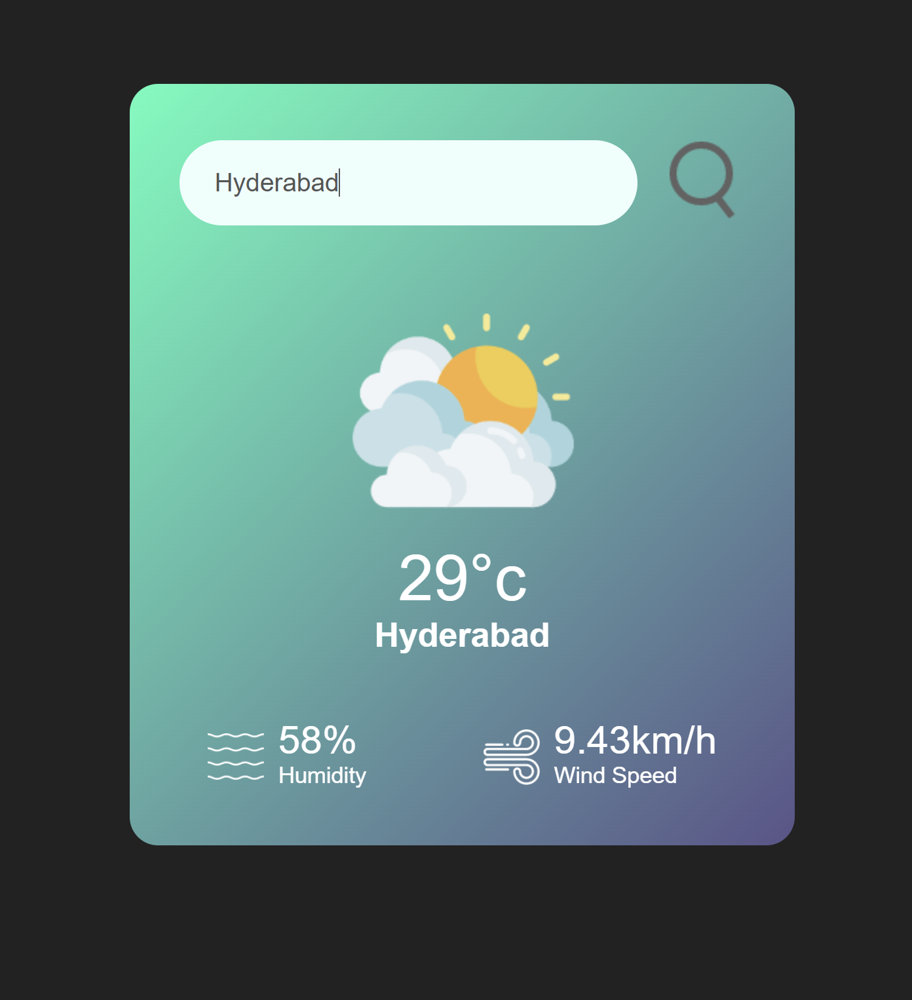

# 🌦️ Weather App

A simple, elegant weather app built using HTML, CSS, and JavaScript that fetches real-time weather data from the OpenWeatherMap API. Just enter the name of any city and get its current temperature, humidity, wind speed and an icon based on the current conditions.

---

## 🖼️ Screenshot



---

## 🚀 Features

- 🌍 Real-time weather data by city name
- 🌡️ Displays temperature in Celsius
- 💧 Humidity level
- 🌬️ Wind speed
- 🎨 Clean and responsive UI
- 🎯 Weather icons based on condition

---

## 🔧 Tech Stack

- **HTML5** – Markup structure  
- **CSS3** – Styling and layout  
- **JavaScript** – Fetching and displaying weather data using `fetch()` API  
- **OpenWeatherMap API** – For real-time weather data

---

## 🔑 API Used

**OpenWeatherMap API**  
You can get your API key by signing up at [OpenWeatherMap](https://openweathermap.org/).

---

## 📌 How to Use

1. Clone the repository:
   ```bash
   git clone https://github.com/jk-117/js-multitools.git
Navigate to the Weather App folder:

bash
Copy
Edit
cd "js-multitools/Weather App"
Open index.html in your browser.

Type a city name and hit "Enter" or click the search icon to get the weather.

